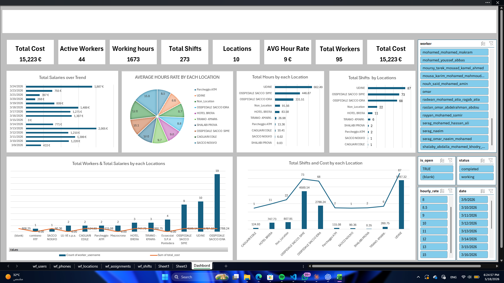

# 🏢 WorkForce Italia — Shift & Cost Management Dashboard

> A comprehensive workforce analytics dashboard built for an Italian company to track employee shifts, working hours, hourly rates, location assignments, and total labor costs in real time.

---

## 📊 Project Overview

**WorkForce Italia** is a data-driven Excel/Power BI dashboard solution designed to give operations managers full visibility over their workforce. The system tracks every shift worked across multiple Italian locations, calculates costs automatically, and surfaces key insights through interactive visualizations.

This project was built to solve a real operational challenge: **managing a distributed team of ~95 workers across 10+ locations** with varying hourly rates, shift schedules, and assignment statuses — all in one unified view.

---

## 🚀 Key Metrics (Sample Data Snapshot)

| Metric | Value |
|---|---|
| 💰 Total Labor Cost | **15,223 €** |
| 👷 Active Workers | **44** |
| 🕐 Total Working Hours | **1,673 hrs** |
| 📋 Total Shifts | **273** |
| 📍 Locations Covered | **10** |
| ⚡ Avg. Hourly Rate | **9 €/hr** |
| 👥 Total Workers (Pool) | **95** |

---

## 📍 Locations Tracked

| Location | Shifts | Hours |
|---|---|---|
| Udine | 87 | 662.49 |
| Ospedale Sacco SIME | 73 | 446.87 |
| Ospedale Sacco IDRA | 68 | 331.51 |
| Non-Location | 22 | 91.56 |
| Hotel Brera | 11 | 83.58 |
| Tirano - K-Mark | 6 | 26.98 |
| Shalabi Prova | 2 | 13.36 |
| Parcheggio ATM | 2 | 10.41 |
| Sacco Nouvo | 1 | 6.02 |
| Cagliari Edile | 1 | 0.03 |

---

## 📈 Dashboard Features

### 📅 Total Salaries Over Trend
Daily salary breakdown from **March 9 to March 24, 2026**, allowing managers to spot high-cost days and plan staffing budgets accordingly.

### 🥧 Average Hours Rate by Each Location
A pie chart showing the distribution of hourly rates across all locations — helping identify which sites consume the most hourly budget.

### 📊 Total Hours by Each Location
Horizontal bar chart ranking locations by total hours worked, making it easy to see where workforce effort is most concentrated.

### 🏁 Total Shifts by Location
Bar chart showing shift counts per location — useful for workload balancing and resource allocation.

### 👥 Workers & Salaries by Location
A combined chart comparing the number of workers deployed vs. total salary cost per location — revealing cost-efficiency per site.

### 💵 Total Shifts and Cost by Location
Final summary chart correlating shift volume to total expenditure at each location.

---

## 🗂️ Data Structure

The workbook contains the following sheets:

| Sheet | Description |
|---|---|
| `wf_users` | Worker profiles and identifiers |
| `wf_phones` | Contact information per worker |
| `wf_locations` | Location master data |
| `wf_assignments` | Worker-to-location assignment records |
| `wf_shifts` | Individual shift logs (date, hours, cost, status) |
| `Sheet1 / Sheet2` | Intermediate calculation layers |
| `Dashboard` | Main interactive analytics view |

---

## 🔧 Filters & Interactivity

The dashboard supports dynamic filtering by:

- 👤 **Worker** — filter all charts by individual employee
- ✅ **Status** — `completed` or `working`
- 🔓 **Is Open** — `TRUE` / `blank`
- 💲 **Hourly Rate** — ranges from 8 to 15 €/hr
- 📅 **Date** — from March 9 to March 16, 2026 (expandable)

---

## 🛠️ Built With

- **Microsoft Excel** — data modeling, pivot tables, and dashboard layout
- **Power Query** — data transformation and cleaning
- **Excel Charts & Slicers** — interactive visualizations
- **Conditional Formatting** — visual KPI highlighting

---

## 💡 Use Cases

- Operations managers monitoring daily shift costs
- HR teams tracking worker deployment across locations
- Finance teams validating labor cost reports
- Site supervisors checking shift completion status

---

## 📁 File Structure

```
workforce-italia-dashboard/
│
├── 📊 WorkForce_Italia_Dashboard.xlsx   # Main workbook with all data & visuals
├── 📸 screenshots/
│   └── dashboard_overview.png           # Dashboard preview image
└── 📄 README.md                         # This file
```

---

## 🖼️ Preview



---

## 👨‍💻 Author

Built as a freelance data analytics project for an Italian operations company.  
Focused on workforce visibility, cost control, and shift management.
